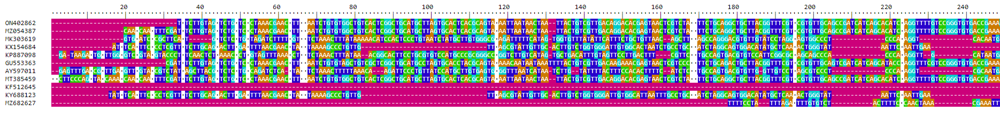

Integrantes:

**Ines Alejandro Garcia Mosqueda A00834571**

**Cesar Arnaldo Cabrera Chavez A01642244**

**Javier Eric Hernandez Garza A01635390**

**Carlos Dhali Tejeda Tapia A00344820**

\_\_\_\_\_\_\_\_\_\_\_\_\_\_\_\_\_\_\_\_\_\_\_\_\_\_\_\_\_\_\_\_\_\_\_\_\_\_\_\_\_\_\_\_\_\_\_\_\_\_\_\_\_\_\_\_\_\_\_\_\_\_\_\_\_\_\_\_\_\_\_\_\_\_\_\_\_\_\_\_\_\_\_\_\_\_\_\_\_\_\_\_\_\_\_\_\_\_\_\_\_\_\_\_\_\_\_\_\_\_\_\_

-   **Link del video sobre nuestra investigacion
    <https://youtu.be/HtCsTefFwjQ>**

¿Cuál es la situación actual de COVID-19 a nivel mundial, en México, en
tu estado de origen y en tu municipio, alcaldía o colonia?

México: 	Nuevos casos: 6,252

Máximo actuales : 299,515 17 ene -- 23 ene, 2022

Muertes: 214

Máximo: 8,922 25 ene--31 ene, 2021

Estado de origen (Jalisco):

			Nuevos Casos: 58

			Máximo: 588,200

			Muertes: 11

			Máximos: 19,415\*\*\*

¿Cuál fue la primera variante del virus que se propagó a todo el mundo?

La variante alfa (también conocida como variante Kent o B.1.1.7) que se
descubrió por primera vez en el sureste de Inglaterra en septiembre de
2020.

¿Cuáles son las otras variantes del virus que existen en otras regiones
del mundo?

Durante la pandemia se han conocido diferentes variantes del virus,
alguna de ellas:

-   Variante Alfa (Identificada por primera vez en Kent, Reino Unido)

-   Variante Beta (Identificadaq en sudafrica)

-   Variante Gamma (Conocida como variante brasileña)

-   Variante Delta (Identificada en India)

-   Variente Eta (primeros casos de esta variante en Reino Unido y
    Nigeria)

-   Variante IOTA (Identificada en la ciudad de Nueva York)

-   Variante Kappa (documentada en la India)

-   Variante Lambda (detectada por primera vez en Perú)

¿Cómo buscarías información de la variante del virus en tu país?

Buscaría información oficial del gobierno o datos e información de
centros de investigacióncomo: <https://coronavirus.gob.mx/>

5.	Imagina que te encuentras en una situación similar a la de Li
Wenliang, médico chino que intentó alertar sobre el brote de coronavirus
en su país, pero fue detenido por las autoridades y obligado a
retractarse, ¿qué harías en su caso? Selecciona un inciso:a) Lo reportas
al centro de investigación o la universidad. b) Lo reportas a la prensa.
c) Guardas la información. Elige y justifica tu respuesta. Revisa el
siguiente video como apoyo:

Lo reportaría a un centro de investigación o universidad. Estas personas
podrían hacer mas sentido de algo que no tengo completamente claro. La
opción b es podría convertirse en una noticia amarilla para alterar a
personas sin ninguna información y la opción c es completamente inútil.

-   ¿Cuáles son los virus "similares" a SARS-CoV-2 en el mundo? Obtén
    tus referencias de PUBMED.

    Existen 6 coronavirus humanos similares a SARS-CoV-2, 2 de ellos son
    altamente patogenos; SARS-CoV y MERS-CoV, y cuatro con baja
    patogenicidad HCoV-229E, HCoV-OC43, HCoV-NL63, and HCoV-HKU1.

-   ¿Cuáles son los coronavirus reportados en otras especies que pueden
    ser cercanos al genoma de SARS-CoV-2? Incluye de qué especies son y
    menciona las referencias de los artículos consultados en PUBMED.

    La secuencia del genoma del SARS-CoV-2 es 96.2% idéntica al genoma
    del coronavirus RaTG13, encontrado en la especie de murciélagos
    Rhinolophus affinis, Los datos genéticos orientan a que el SARSCoV-2
    pudo haberse originado en murciélagos

    De igual manera, en esta imagen se puede observar el origen y
    evolución de los coronavirus patógenos. Su especie animal natural y 
    su especie animal inetmediaria 

    {width="399"}

-   En relación con la situación actual reflexiona, ¿qué propondrías que
    se deba hacer durante la contingencia del SARS-CoV-2 en comunidades
    de bajos recursos? Si tu vivieras en una situación de escasos
    recursos, ¿qué harías? Justifica tu respuesta.

    Nosotros propondríamos 2 planes cuya función es apoyar a las
    comunidades de bajos recursos durante la contingencia. El primero
    sería realizar una despensa comunitaria. Para esto es necesario
    colocar la colecta en un lugar accesible para las personas que
    busquen donar y para las personas que deseen retirar. También sería
    importante mencionar que es una despensa solidaria y que cualquiera
    puede donar. El segundo plan sería crear una recaudación de fondos o
    participar en una existente, para la compra de medicamentos. 

    Si nosotros nos encontráramos en una situación de bajos recursos,
    concluimos que la mejor opción sería solicitar alimentos a
    organizaciones o fundaciones que se encarguen de esto o solicitar
    medicamentos a servicios de salud pública. 

-   Referencias:

    <https://alerta.salud.gob.sv/sars-cov-2-origen-estructura-replicacion-y-patogenesis/>

    <https://pubmed.ncbi.nlm.nih.gov/30531947/>

    <https://www.annualreviews.org/doi/10.1146/annurev-micro-110520-023212#_i3>

**En el teniendo los archivos virus_seqs.fasta y virus_seqs_align.fasta
solo es necesario correr los chunks marcados con: \*\*\***

```{r setup, include=FALSE}
knitr::opts_chunk$set(echo = TRUE)
rm(list = ls())
```

-   De las siguientes tres opciones, selecciona una opción para
    investigar: Analizar las secuencias de SARS-CoV-2 reportadas en los
    20 países con más casos reportados. Y puedes tratar de responder a
    la pregunta: ¿Son muy diferentes las variantes entre cada país? ¿Es
    diferente el SARS-CoV-2 entre las diferentes poblaciones: Asiática,
    Hispana, Europea o Africana?
-   Trabajar con las secuencias de los coronavirus de otras especies que
    son similares a SARS-CoV-2, para tratar de explicar el fenómeno de
    zoonosis del virus. Incluye 20 especies reportadas. Puedes trabajar
    con variantes de SARS-CoV-2 de otros países.
-   **Estudia la cercanía de SARS-CoV-2 con otros coronavirus humanos
    que ocasionan enfermedades similares (como MERS). En tu
    investigación debes trabajar con 20 virus diferentes.**

### **Coronavirus humanos**

Actualmente hay 7 tipos de coronavirus que infectan humanos contando el
SARS-CoV-2 cuatro de ellos (HCoV-229E, HCoV-OC43, HCoV-NL63 y HCoV-HKU1)
son muy comunes y algunos de ellos están presentes en el resfriado común
junto a otros agentes patógenos como los rinovirus. Otros como el
SARS-Cov, MERS-Cov y SARS-Cov-2 han sido los que han aparecido
actualmente ocacionando pandemias

**SARS-CoV:** El primero de ellos en aparecer fue virus SARS-CoV
(síndrome respiratorio agudo severo) La pandemia que supuso el SARS-CoC
fue contenida en poco más de 6 meses

**MERS-CoV:** Más recientemente, en 2012, apareció el virus MERS-CoV
(síndrome respiratorio del Oriente Medio). Desde el punto de vista
genético es un primo lejano de SARS-CoV con el que comparte
aproximadamente el 80% de su genoma, que se extendió a 27 países de
Asia, Europa, África y Norte Américainfectando a menos de 2.500 personas
pero de las que murieron más de 850, lo supone una tasa de letalidad del
34,5 %

**SARS-CoV-2:** En diciembre de 2019 se reportó la aparición del más
reciente de los coronavirus que infectan humanos el SARS-CoV-2, en
Wuhan, China. Causante de la pandemia actual

<https://www.nationalgeographic.com.es/ciencia/siete-tipos-coronavirus-que-infectan-humanos_15353>

### **\*\*\*Importacion de librerias requeridas en el entorno de desarrollo**

```{r}
#if (!requireNamespace("BiocManager", quietly = TRUE))
#    install.packages("BiocManager")
#BiocManager::install("Biostrings")
#if (!requireNamespace("BiocManager", quietly = TRUE))
#    install.packages("BiocManager")
#BiocManager::install("ggtree")
#if (!requireNamespace("BiocManager", quietly = TRUE))
#    install.packages("BiocManager")
#BiocManager::install("DECIPHER")
library(seqinr)
library(ggplot2)
library(ggthemes)
library(DECIPHER)
library(Biostrings)
library(adegenet) 
library(ape) 
library(ggtree)
library(viridis)
```

### **Claves del genbank**

**Tipos de Coronavirus:**

| Betacoronavirus | Alphacoronavirus |
|-----------------|------------------|
| ON402862        | MZ682627         |
| MZ054387        | DQ462754         |
| MK303619        | FJ656171         |
| KX154684        | KC294433         |
| KP887098        | KM077085         |
| GU553363        | KT359907         |
| AY597011        | KM055542         |
| MT385459        | LC488390         |
| KF512645        | KX285715         |
| KY688123        | KX179494         |

### **Asignacion de virus a un array (no es necesario correr chunk)**

```{r}
virus <-c("ON402862","MZ054387","MK303619","KX154684","KP887098","GU553363","AY597011","MT385459","KF512645","KY688123","MZ682627","DQ462754","FJ656171","KC294433","KM077085","KT359907","KM055542","LC488390","KX285715","KX179494")
```

### **Importacion de secuencias de virus desde Gen Bank (no es necesario correr chunk)**

En caso de tener archivo virus_seqs.fasta no ejecutar este chunk

```{r}
virus_sequences <- read.GenBank(virus)
str(virus_sequences)
```

### **Escritura de archivo fasta de las secuencias para importacion offline (no es necesario correr)**

Este codigo escribe un documento con las secuencias de los virus por
analizar

Correr en caso de no tener archivo: virus_seqs.fasta

```{r}
write.dna(virus_sequences,  file ="virus_seqs.fasta", format = "fasta", append =
FALSE, nbcol = 6, colsep = " ", colw = 10)
```

### **\*\*\*Longitud de las secuencias**

```{r}
virus_sequences <-read.fasta("virus_seqs.fasta")
virus_names = names(virus_sequences)
for (i in 1:length(virus_sequences)){ 
  print(paste(virus_names[i],length(virus_sequences[[i]]),sep="= "))
}
```

### **\*\*\*Conteo de nucleotidos**

```{r}
set = rbind()
seta = rbind()
setc = rbind()
setg = rbind()
sett = rbind()

for(i in 1:20){
  s=count(virus_sequences[[i]],1)
  set=cbind(set,(s))
  seta = cbind(seta,s[1])
  setc = cbind(setc,s[2])
  setg = cbind(setg,s[3])
  sett = cbind(sett,s[4])
}
barp=barplot(set,main = "Comparacion general de nucleotidos",legend=T,col=c("#E51932","#32FF00","#FFFF32","#654CFF"), names.arg=virus_names,las=2)

```

**Visualizacion separada por nucleotido**

```{r}


barp=barplot(seta,main = "Comparacion adeninas",legend=T,col="#E51932", names.arg=virus_names,las=2)
barp=barplot(setc,main = "Comparacion citosinas",legend=T,col="#32FF00", names.arg=virus_names,las=2)
barp=barplot(setg,main = "Comparacion guaninas",legend=T,col="#FFFF32", names.arg=virus_names,las=2)
barp=barplot(sett,main = "Comparacion timinas",legend=T,col="#654CFF", names.arg=virus_names,las=2)

```

En las graficas se puede visualizar la proporcion de cada nucleotido en
cada virus

### **\*\*\*Lectura de archivo fasta de las secuencias**

```{r}
virus_seq_not_align <-readDNAStringSet("virus_seqs.fasta", format = "fasta")
```

### **\*\*\*Visualizacion de secuencias guaradas en dataframe**

```{r}
virus_seq_not_align
```

### **Orientacion y alineamiento de nucleotidos (no es necesario correr alineamiento)**

Estas lineas de codigo sirven para crear las secuencias alineadas, pero
en la linea de abajo se guardan archivos ya compilados

Correr en caso de no tener archivos: virus_seqs_align.fasta

```{r}
#virus_seq_not_align <- OrientNucleotides(virus_seq_not_align)
#virus_seq_align <- AlignSeqs(virus_seq_not_align)
```

### **Escritura de archivo fasta de secuencia alineada (no es necesario correr chunk)**

No es necesario correr chun si existe el archivo virus_seq_alignn.fasta
en la carpeta

```{r}
#writeXStringSet(virus_seq_align, file="virus_seq_align.fasta")
```

### **\*\*\*Lectura de archivo con secuencias alineadas**

```{r}
virus_seq_align <- read.alignment("virus_seq_align.fasta", format = "fasta")
```

### **\*\*\*Visualizacion de alineamiento en el navegador**

Para analizar mas profundamente el alineamineto de los nucleotidos
ejecutar el siguiente chunk para abrir una pagina en el navegador



```{r}
#BrowseSeqs(virus_seq_align, highlight=0)
```

### **\*\*\*Generacion de matriz de distancia para filograma y creacion del filograma**

```{r}
matriz_distancia <- dist.alignment(virus_seq_align, matrix = "similarity")
virus_tree <- njs(matriz_distancia)
virus_tree <- ladderize(virus_tree)
plot(virus_tree, cex = 0.6)
title("Tipos de coronavirus")
```

### **Interpretacion de datos**

Podemos observar que hay virus que tienen estructuras similares, y que
tienen un contenido genético de tamaños parecidos. De los
Betacoronavirus, todos son muy parecidos, excepto por KF512645 (la
penúltima), e inclusive unos casi iguales. Tienen proporciones similares
de bases, y el tamaño de la cadena contiene casi los mismos nucleótidos.
En cuanto a los Alpha Coronavirus, son más variados y presentan tamaños
y proporciones considerablemente distintas. MZ682627 y LC488390 son los
más parecidos en cuanto a tamaño y proporciones, y son los que contienen
mayor número de nucleótidos dentro de esta clasificación.

### **Conclusion**

A partir del estudio de las secuencias de los virus se pueden ver como
has sido la evolución de los coronavirus humanos. Conociendo las
características de estos virus, como la inmunidad, enfermedades
ocasionadas, etc. se podría hacer una comparación de ciertas partes de
las secuencias genéticas que sirvan para generar medicinas, vacunas o
que nos ayuden a comprender porque pueden llegar a ser tan contagiosos o
letales. De igual manera, el análisis de estos virus a partir de la
historia nos permite crear una base de datos donde recopilemos sus
comportamientos al tratarlos, para así cuando se detecte un virus nuevo
y este sea parecido a uno previamente analizado, lo podamos tratar
fácilmente. Incluso esto nos serviría para prevenirlos, eliminando malas
prácticas donde suelen crearse y propagarse.

\
